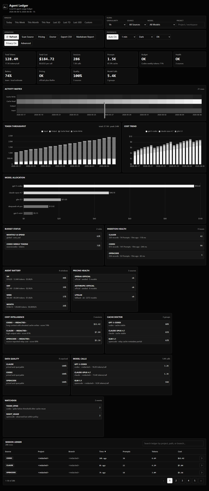

# Agent Ledger

Private local AI Agent FinOps, quota, pricing, audit, and productivity console for Claude Code, Codex, OpenCode, OpenClaw, kiro, Pi, and related local coding agents.

[中文文档](README_CN.md)



## Fork And Credits

Agent Ledger is an independent ZhenZhi second-development project based on [briqt/agent-usage](https://github.com/briqt/agent-usage). We keep the local-first collector foundation and thank the original author and contributors for the clean single-binary design.

The project has been renamed from `agent-usage` to `agent-ledger`. Old local databases and configs are not deleted automatically.

## What It Does

- Collects local usage records from Claude Code, Codex, OpenCode, OpenClaw, kiro, and Pi.
- Calculates token cost with local pricing governance: local overrides, official OpenAI/Anthropic seeds, and LiteLLM fallback.
- Explains expensive sessions without reading prompt content.
- Tracks budgets, burn rate, local quota estimates, cache health, model call counts, anomalies, and source health.
- Provides local audit logs, privacy presets, exports, reports, evidence bundles, and team showback data.
- Runs as one Go binary with embedded static UI and SQLite.

## Quick Start

```bash
git clone https://github.com/zhenzhis/agent-ledger.git
cd agent-ledger
go build -o agent-ledger .
./agent-ledger
```

Open [http://127.0.0.1:9800](http://127.0.0.1:9800).

Docker:

```bash
docker compose up -d --build
```

CLI:

```bash
./agent-ledger today
./agent-ledger top
./agent-ledger doctor
./agent-ledger battery
./agent-ledger pricing sync
./agent-ledger wrapped
```

## Configuration

Config search order:

1. `--config path/to/config.yaml`
2. `/etc/agent-ledger/config.yaml`
3. `./config.yaml`

Minimal example:

```yaml
server:
  port: 9800
  bind_address: "127.0.0.1"

storage:
  path: "./agent-ledger.db"

pricing:
  sync_interval: 1h
  stale_after: 24h
  mode: official-plus-litellm
  overrides: []

privacy:
  default_preset: normal
  redact_paths: false
  hash_session_ids: false
  hide_project_names: false
  screenshot_mode: false
```

Use `pricing.overrides` for enterprise contracts, relay pricing, regional multipliers, or provider-specific discounts.

## Pricing Model

Agent Ledger stores non-overlapping token components:

```text
total = input_tokens
      + cache_creation_input_tokens
      + cache_read_input_tokens
      + output_tokens
```

Cost formula:

```text
cost = input_tokens * input_price
     + cache_creation_input_tokens * cache_write_price
     + cache_read_input_tokens * cache_read_price
     + output_tokens * output_price
```

Pricing priority:

1. Local override.
2. Official OpenAI/Anthropic seed rows.
3. LiteLLM fallback from `model_prices_and_context_window.json`.
4. Source-reported cost, preserved for sources such as OpenCode when present.

Every priced record can expose pricing source, matched model, match type, and confidence. Unknown or stale prices are surfaced as data quality issues instead of being hidden.

References:

- [OpenAI API pricing](https://openai.com/api/pricing/)
- [Anthropic Claude pricing](https://platform.claude.com/docs/en/about-claude/pricing)
- [LiteLLM model price data](https://github.com/BerriAI/litellm/blob/main/model_prices_and_context_window.json)

## Architecture

```text
collectors -> SQLite raw usage -> pricing governance -> cost recalculation
           -> aggregate tables -> REST API -> embedded dashboard / CLI
```

Core tables:

- `usage_records`: raw API-call token and cost data.
- `sessions`: source-scoped session metadata.
- `prompt_events`: prompt timestamps for time-accurate prompt counts.
- `pricing`, `pricing_sources`, `pricing_snapshots`: effective price rules and source health.
- `hourly_usage_aggregate`, `daily_usage_aggregate`: dashboard rollups.
- `ingestion_health`, `insight_events`, `audit_log`: operations and quality evidence.

## API Surface

Common filters: `from`, `to`, `source`, `model`, `project`, `privacy`.

| Endpoint | Purpose |
|---|---|
| `GET /api/stats` | Summary stats |
| `GET /api/sessions` | Server-side paginated session ledger |
| `GET /api/pricing/status` | Pricing freshness, source state, unpriced models |
| `POST /api/pricing/sync` | Sync pricing |
| `POST /api/pricing/recalculate?mode=zero|all` | Recalculate costs |
| `GET /api/cost-intelligence` | Expensive session explanations |
| `GET /api/cache/doctor` | Cache hit/write/read diagnostics |
| `GET /api/data-quality` | Trust and completeness report |
| `GET /api/model-calls` | Calls by model/source/project |
| `GET /api/quota/status` | Local quota and burn-rate estimates |
| `GET /api/anomalies` | Robust-statistics anomaly events |
| `GET /api/evidence-bundle` | Redacted support/audit bundle |
| `GET /api/export?type=sessions&format=csv` | CSV/JSON exports |
| `GET /api/report?format=markdown` | Markdown report |

Manual scan, reset, pricing sync, imports, and recalculation require localhost access unless auth tokens are configured.

## Security Model

- Binds to `127.0.0.1` by default.
- Reads local agent logs and databases; it does not upload usage data.
- Pricing sync is the expected outbound request.
- Manual operations are localhost-only by default.
- Optional RBAC supports `viewer`, `operator`, and `admin` tokens.
- Privacy presets can hide paths, project names, branches, machine names, and session IDs.
- Webhooks are disabled by default and should only send redacted summaries.

## Development

```bash
go test ./...
go vet ./...
node --check internal/server/static/app.js
docker compose up -d --build
```

On hosts without Go installed:

```bash
docker run --rm -v "$PWD:/src" -w /src golang:1.25.11-alpine sh -c "gofmt -w . && go test ./..."
```

## License

Apache-2.0. See [LICENSE](LICENSE).
